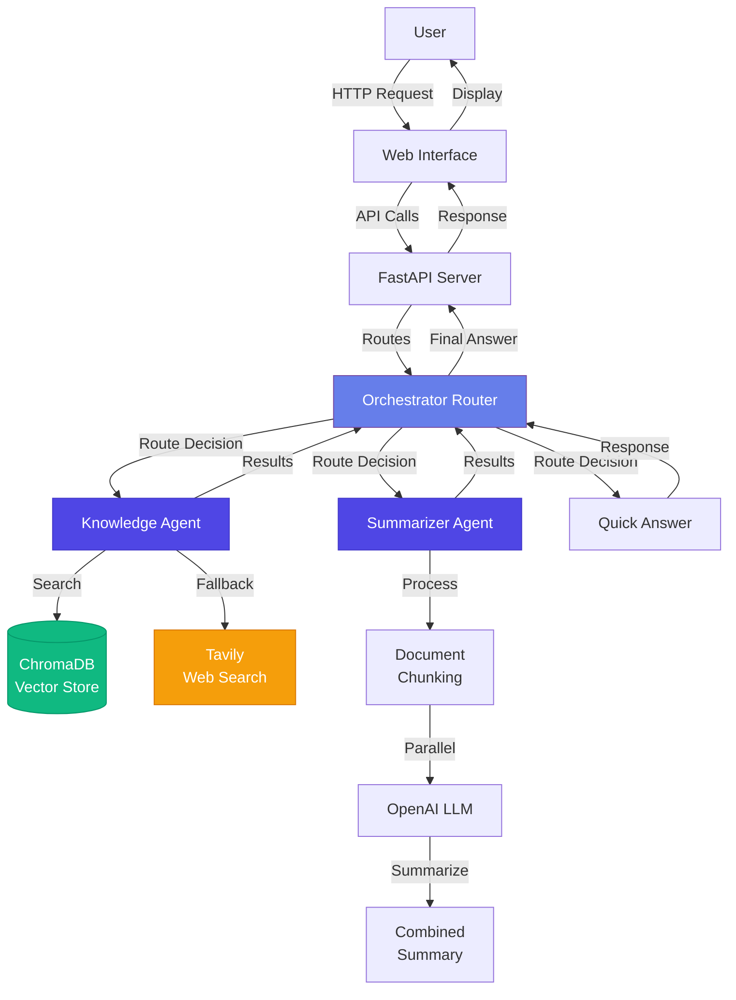
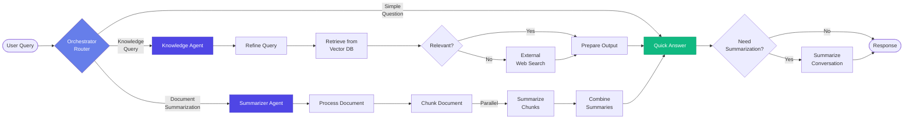
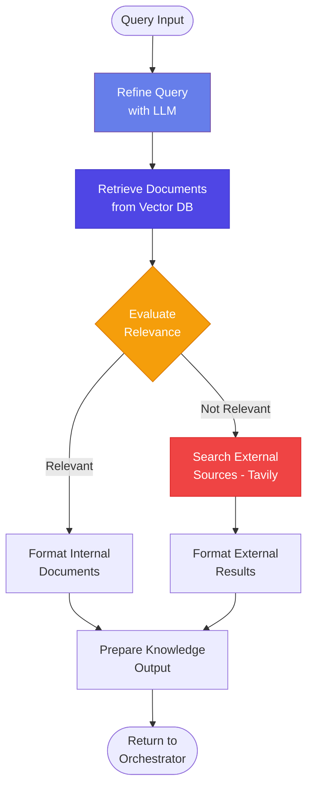
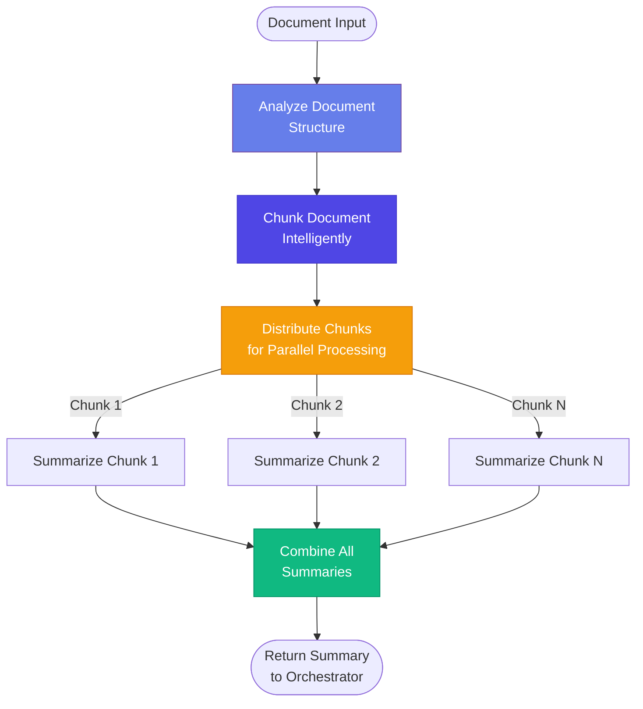
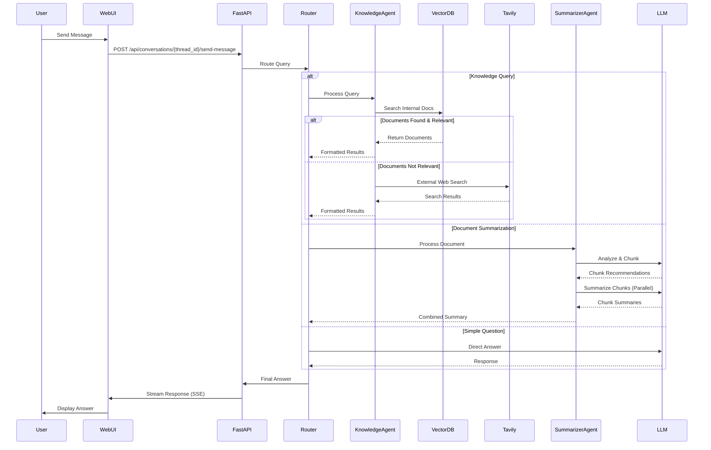
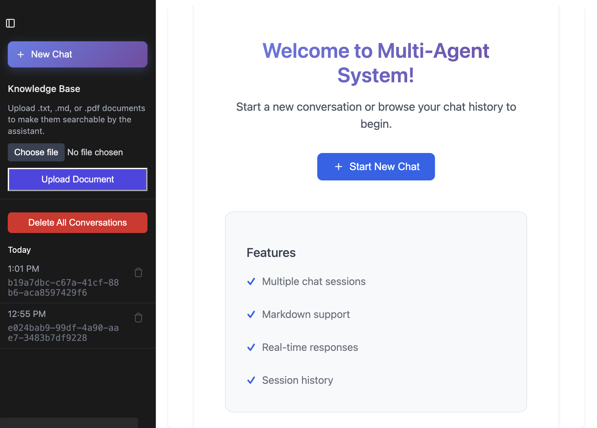
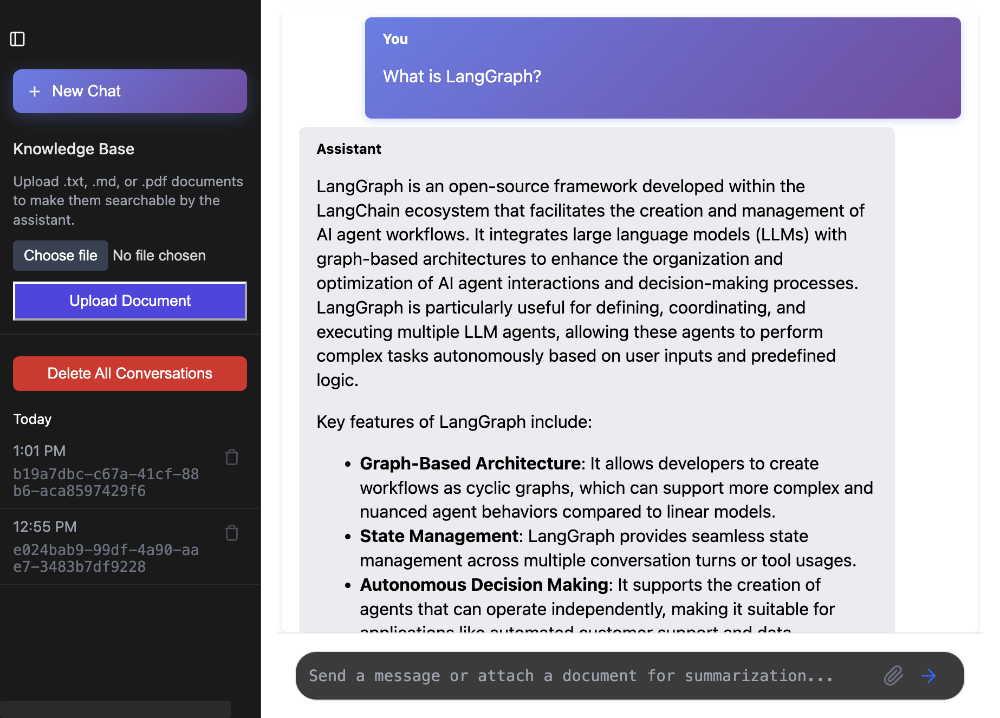
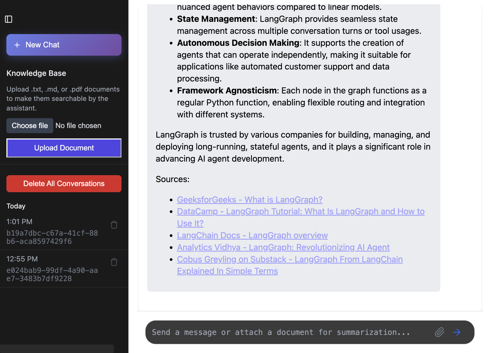
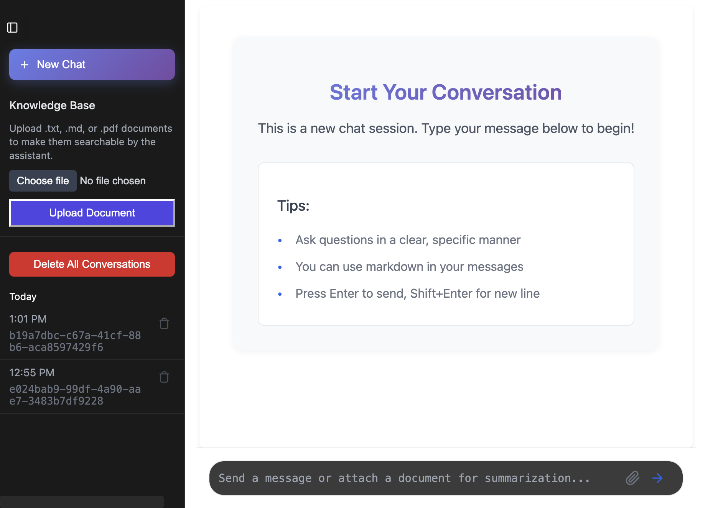

# Multi-Agent LangGraph System

A sophisticated multi-agent system designed to answer questions by leveraging internal knowledge bases, external search, and document summarization - all orchestrated through a modern web interface.

## 🚀 Features

- 🤖 **Specialized Agents**: Dedicated agents for knowledge retrieval and summarization, each optimized for their specific tasks
- 🎯 **Intelligent Routing**: A central router analyzes incoming queries and directs them to the most suitable agent or processing path
- 📚 **Knowledge-First Approach**: Prioritizes searching internal document base before resorting to external searches, providing properly sourced responses
- 🔍 **External Search Integration**: Seamlessly transitions to web search when internal knowledge is insufficient, with proper citation of sources
- 📝 **Efficient Summarization**: Processes and condenses large documents using a map-reduce approach with LLM-powered chunking
- 🌐 **Advanced Orchestration**: Utilizes LangGraph for robust, graph-based agent coordination and conversation flow control
- 🧠 **Contextual Conversations**: Maintains conversation history and context, with automatic summarization for longer interactions
- 💻 **Modern Web Interface**: Clean, responsive UI with gradient design for interacting with the multi-agent system

## 📋 Requirements

- Python >= 3.11
- OpenAI API Key (Required)
- Tavily API Key (Required)
- LangSmith API Key (Optional - for tracing/debugging)

## 🛠️ Installation

1. **Clone the repository:**
```bash
git clone https://github.com/soni0021/Multi_Agent_Langgraph.git
cd Multi_Agent_Langgraph
```

2. **Install dependencies using `uv` (recommended):**
```bash
# Install uv
curl -LsSf https://astral.sh/uv/install.sh | sh

# Create virtual environment and install dependencies
uv venv
source .venv/bin/activate
uv pip install -e .
uv pip install "langgraph-cli[inmem]"
```

3. **Set up environment variables:**
```bash
# Create .env file in src/backend/
cp src/backend/.env.example src/backend/.env
# Edit .env with your API keys
```

4. **Run the application:**
```bash
langgraph dev --no-browser
```

The application will be available at `http://127.0.0.1:2024`

## 📝 Configuration

Create a `.env` file in `src/backend/` with:

```env
OPENAI_API_KEY=your_openai_api_key_here
TAVILY_API_KEY=your_tavily_api_key_here
LANGCHAIN_API_KEY=your_langchain_api_key_here  # Optional
```

> **Note**: LangSmith API key is **OPTIONAL**. The system works perfectly without it. LangSmith is only needed for tracing, debugging, and monitoring. See [LANGSMITH_INFO.md](LANGSMITH_INFO.md) for details.

## 📁 Project Structure

```
multi_agent_system/
│
├── src/
│   ├── backend/                    # Backend server and agent logic
│   │   ├── agents/                 # Agent implementations
│   │   │   ├── knowledge/          # Knowledge retrieval agent
│   │   │   │   ├── __init__.py
│   │   │   │   ├── graph.py        # Knowledge agent workflow graph
│   │   │   │   ├── prompts.py      # LLM prompts for knowledge agent
│   │   │   │   ├── schemas.py      # State schemas for knowledge agent
│   │   │   │   └── tools.py        # RAG and Tavily search tools
│   │   │   ├── orchestrator/       # Central router logic
│   │   │   │   ├── __init__.py
│   │   │   │   ├── graph.py        # Main orchestrator graph
│   │   │   │   ├── prompts.py      # Router and answer prompts
│   │   │   │   └── schemas.py      # Agent state schemas
│   │   │   └── summarizer/         # Document summarization agent
│   │   │       ├── __init__.py
│   │   │       ├── graph.py         # Summarizer workflow graph
│   │   │       ├── prompts.py      # Summarization prompts
│   │   │       ├── schemas.py      # Summarizer state schemas
│   │   │       └── tools.py        # Document chunking tools
│   │   ├── utils/                  # Shared utilities
│   │   │   ├── __init__.py
│   │   │   ├── document_ingestion.py  # Document upload and ingestion
│   │   │   ├── file_utils.py          # File processing utilities
│   │   │   └── message_utils.py      # Message formatting utilities
│   │   ├── app.py                  # FastAPI application
│   │   ├── config.py                # Configuration management
│   │   ├── routes.py                # API endpoints
│   │   ├── schemas.py               # Pydantic models for API
│   │   ├── exceptions.py            # Custom exception classes
│   │   └── .env.example             # Environment variables template
│   │
│   └── static/                      # Frontend assets
│       ├── index.html              # Main HTML interface
│       ├── js/
│       │   ├── config/
│       │   │   └── config.js        # API configuration
│       │   └── script.js           # Frontend JavaScript logic
│       └── styles/
│           └── main.css             # CSS styling
│
├── screenshots/                     # Application screenshots
│   ├── 1-welcome-screen.png
│   ├── 2-chat-interface-empty.png
│   ├── 3-chat-with-conversation.png
│   ├── 4-sidebar-with-conversations.png
│   ├── 5-empty-new-chat.png
│   └── 6-knowledge-base-section.png
│
├── examples/                        # Example use cases
│   └── use_cases.md
│
├── data/                            # Data storage (created at runtime)
│   └── chroma_db/                  # Vector database storage
│
├── .github/                         # GitHub configuration
│   └── workflows/                   # GitHub Actions workflows
│
├── API_KEY_FIX.md                   # API key troubleshooting guide
├── LANGSMITH_INFO.md                # LangSmith integration info
├── REQUIRED_KEYS_SUMMARY.md        # Quick API keys reference
├── SETUP_REQUIREMENTS.md            # Detailed setup guide
├── README.md                        # This file
├── LICENSE                          # MIT License
├── langgraph.json                   # LangGraph configuration
├── pyproject.toml                   # Python project configuration
├── uv.lock                          # Dependency lock file
└── .gitignore                       # Git ignore rules
```

## 🏗️ System Architecture

### High-Level Architecture



### Agent Workflow Diagram



### Detailed Knowledge Agent Flow



### Summarizer Agent Flow



## 🔄 Request Flow



## 📸 Screenshots

### 1. Welcome Screen

*Modern welcome screen with gradient UI, feature highlights, and conversation history*

### 2. Empty Chat Interface

*Clean new chat interface ready for conversation with helpful tips*

### 3. Active Chat Conversation

*AI assistant responding to user queries with detailed, well-formatted responses and source citations*

### 4. Sidebar with Conversation History

*Sidebar showing conversation history, knowledge base, and navigation options*

### 5. New Empty Chat Session

*Starting a fresh conversation session with empty chat interface*

### 6. Knowledge Base Upload Section

*Document upload feature for adding .txt, .md, or .pdf files to the knowledge base*

## 🧩 Key Components

### 1. Orchestrator (Router)
- **Location**: `src/backend/agents/orchestrator/graph.py`
- **Purpose**: Central decision-making node that routes queries to appropriate agents
- **Key Functions**:
  - `route_message()`: Analyzes query and determines routing path
  - `answer()`: Generates final response using agent outputs
  - `summarize_conversation()`: Manages conversation history

### 2. Knowledge Agent
- **Location**: `src/backend/agents/knowledge/graph.py`
- **Purpose**: Retrieves information from internal knowledge base or external sources
- **Key Functions**:
  - `refine_query()`: Optimizes query for better retrieval
  - `direct_retrieval()`: Searches vector database
  - `check_internal_docs()`: Evaluates document relevance
  - `external_search_node()`: Falls back to Tavily web search
  - `prepare_output()`: Formats results for orchestrator

### 3. Summarizer Agent
- **Location**: `src/backend/agents/summarizer/graph.py`
- **Purpose**: Processes and summarizes large documents
- **Key Functions**:
  - `analyze_document_structure()`: Determines optimal chunking strategy
  - `process_document_node()`: Chunks document intelligently
  - `summarize_chunk()`: Summarizes individual chunks (parallel)
  - `combine_summaries()`: Combines all chunk summaries

### 4. Vector Database (ChromaDB)
- **Purpose**: Stores and retrieves document embeddings
- **Location**: `data/chroma_db/` (created at runtime)
- **Integration**: Used by Knowledge Agent for RAG (Retrieval Augmented Generation)

### 5. Web Interface
- **Frontend**: `src/static/`
- **Features**:
  - Real-time chat with SSE streaming
  - Document upload for knowledge base
  - Session management
  - Conversation history
  - Modern gradient UI design

## 🔧 API Endpoints

| Endpoint | Method | Description |
|----------|--------|-------------|
| `/api/` | GET | API status check |
| `/api/new-thread` | GET | Create new conversation thread |
| `/api/conversations-list` | GET | Get all conversations |
| `/api/conversations/{thread_id}` | GET | Get specific conversation |
| `/api/conversations/{thread_id}/send-message` | POST | Send message to thread |
| `/api/conversations/{thread_id}/stream-message` | GET | Stream response (SSE) |
| `/api/conversations/{thread_id}` | DELETE | Delete specific thread |
| `/api/conversations` | DELETE | Delete all threads |
| `/api/upload-document/` | POST | Upload document to knowledge base |

## 📖 Documentation

- [Setup Requirements](SETUP_REQUIREMENTS.md) - Detailed setup guide
- [Required Keys Summary](REQUIRED_KEYS_SUMMARY.md) - API keys reference
- [LangSmith Info](LANGSMITH_INFO.md) - Information about optional LangSmith integration
- [API Key Fix Guide](API_KEY_FIX.md) - Troubleshooting API key issues

## 🎯 Use Cases

1. **Question Answering**: Ask questions and get answers from your knowledge base or web search
2. **Document Summarization**: Upload large documents and get concise summaries
3. **Research Assistant**: Combine internal knowledge with external web search
4. **Knowledge Base Management**: Build and maintain a searchable document repository

## 🛠️ Technology Stack

- **Backend**: FastAPI, Python 3.11+
- **AI Framework**: LangGraph, LangChain
- **LLM**: OpenAI GPT-4o
- **Embeddings**: OpenAI text-embedding-3-small
- **Vector DB**: ChromaDB
- **Web Search**: Tavily API
- **Frontend**: Vanilla JavaScript, HTML5, CSS3
- **Package Management**: uv

## 📄 License

This project is licensed under the MIT License - see the [LICENSE](LICENSE) file for details.


## 🙏 Acknowledgments

Built with:
- [LangGraph](https://github.com/langchain-ai/langgraph) - Multi-agent orchestration
- [LangChain](https://github.com/langchain-ai/langchain) - LLM framework
- [FastAPI](https://fastapi.tiangolo.com/) - Web framework
- [ChromaDB](https://www.trychroma.com/) - Vector database
- [Tavily](https://tavily.com/) - Web search API

